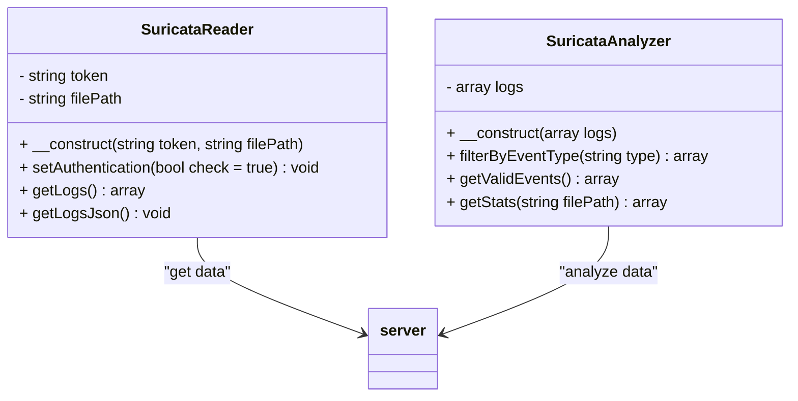
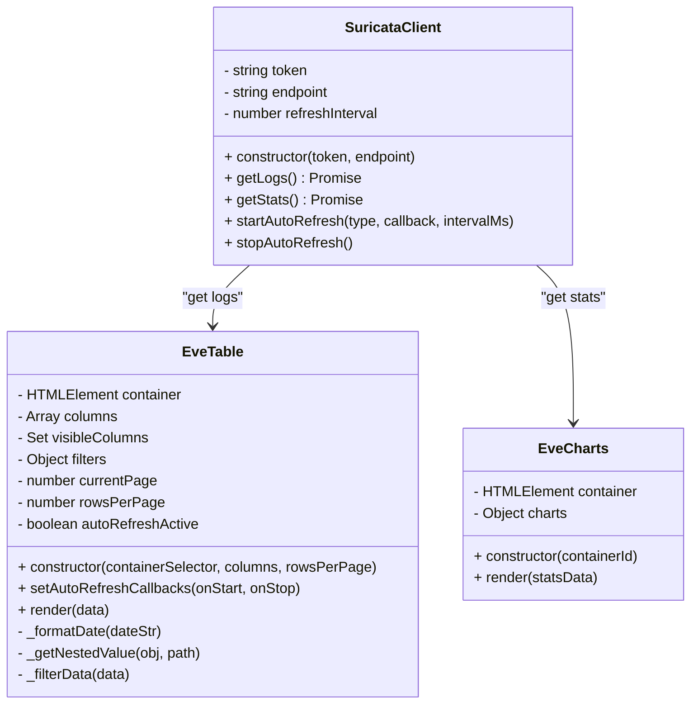

  
   
  <strong>What is Suricata?</strong>
   
  <em>"Your vigilant guardian in the digital world!"</em>

# Suricata Watcher

**Suricata Watcher** is a lightweight web dashboard built with **HTML, CSS, JavaScript, and PHP**, designed to quickly view and analyze logs generated by **Suricata**.

The tool reads directly from the Suricata `eve.json` log file and presents it in a browser-friendly view, allowing you to filter, search, and monitor events in real-time or near real-time.

---

## ✨ Features

- ✅ Directly reads the `eve.json` file (NDJSON format)
- ✅ Displays alerts in an easy-to-read table
- ✅ Filter by severity, protocol, source/destination IP
- ✅ Automatic or manual updates
- ✅ Simple and lightweight interface, no heavy frameworks required

---

## 📦 Requirements

- Debian packages `apt install apache2 php libapache-mod-php`
- A server with **PHP** enabled (local setups like XAMPP, Apache, or Nginx work fine)
- Read access to the `eve.json` file generated by Suricata

---

## 🚀 Quick Start

1. Copy the project files into your web server directory as `git clone https://github.com/P1c1s/suricata-watcher/ /var/www/html`
2. modify `DOMAIN` in `suricata.sh`
3. modify `define('BASE_URL', '<custom url>')` in `config/config.php`
4. Run `.suricata.sh`

#### Php classes

#### JavaScript classes

